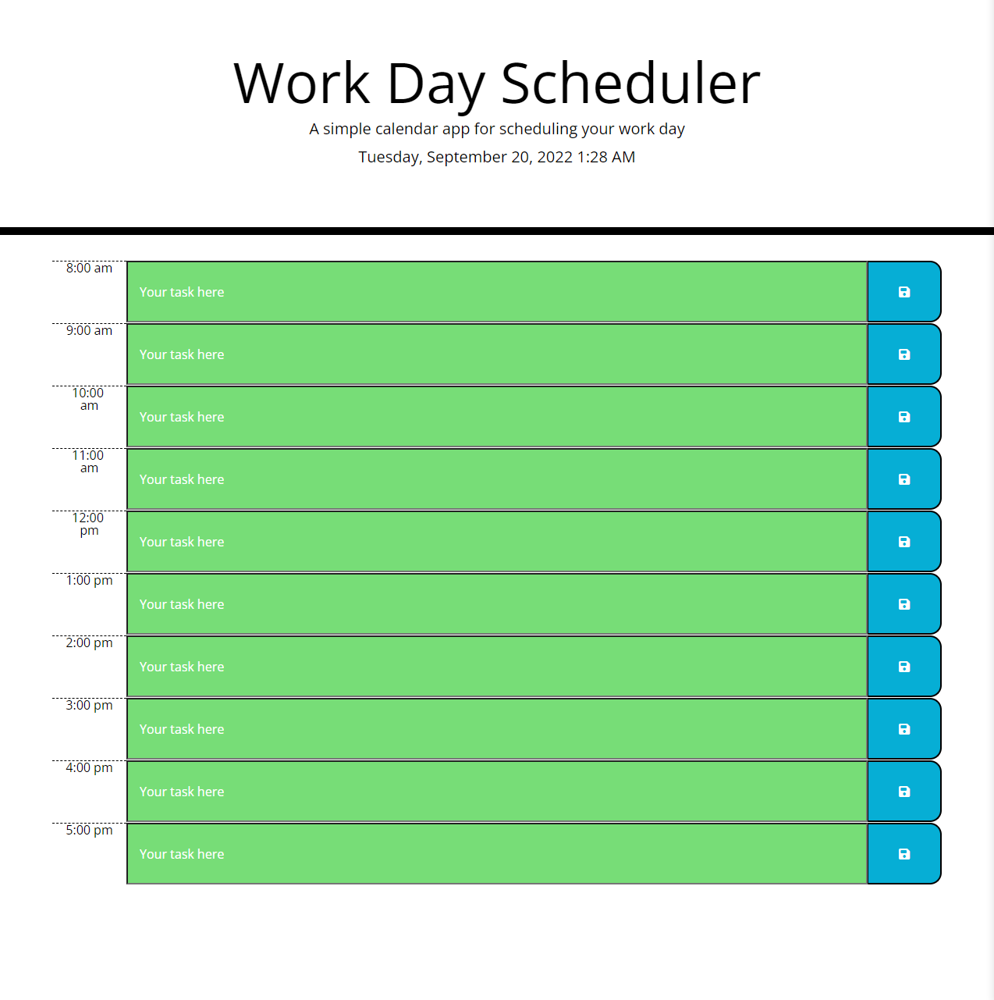

# James Porter's Work Day Scheduler

## Description

Manage your work day with this simple, easy to use calendar and increase your producivitiy while enabling good discipline! 

- To exercise Javascript skills, partiocularly use of jQuery, Moment.js and saving / retrieving from local storage. 
- This project was built primarily as an exercise in Javascript.  

## Usage

First, click the following link: https://jamesjporter.github.io/Day-Planner-JP/

Once you have arrived at the app, you will notice that each calendar entry is color coded based upon whether the time is past, current or present. You may then click inside of any hours text area and enter your task. Once entered, click the blue save icon to the right and your task will remain saved. 

Link to live repo: https://github.com/JamesJPorter/Day-Planner-JP

    

## Credits

Primary engineer: James Porter
With assistance from: Sofia Tejada, Sandrine Poissonnet and Erik Chan, Cody Williams
